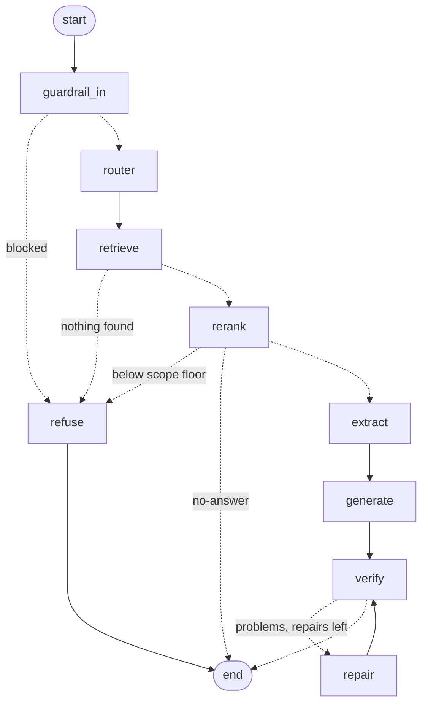

# Agents

The query side, as five stages around the retrieval that already worked.
`retrieval/` turns a question into five passages; this turns a question into an
answer that has been checked, and refuses when it should.

The flow is a **LangGraph** graph — [`graph.py`](graph.py) holds the nodes, the
three early exits and the repair loop. [`orchestrator.py`](orchestrator.py) owns
the agents those nodes call, and `arun` seeds the state and invokes the graph.
There is no second, hand-rolled path through the stages, which is the point: a
graph you draw and a graph you run should not be two different graphs.

Every stage is an **LCEL chain** — `prompt | model | parser` — collected in
[`chains.py`](chains.py). The four agent modules below are about what a call
*means*; that file is about how it is made.

```
[question]
    │
    ▼
[1. guardrail — NeMo input rails] ──(blocked)──► a refusal, and nothing else runs
    │
    ▼
[2. router] ─────────────► which kind of row holds the answer, how literal the query is
    │
    ▼
[hybrid retrieval + rerank] ─► retrieval.Pipeline, unchanged → top 5
    │
    ▼
[scope floor] ───────────(nothing relevant)──► "not in this corpus"
    │
    ▼
[3. extractor] ──────────► the numbers, bounds, conditions and table rows
    │
    ▼
[4. generator] ──────────► a draft citing [1]..[5]
    │
    ▼
[5. verifier — NeMo output rail] ──(problems)──► one repair, then accept
    │
    ▼
[answer]
```

## Drawing it

The picture comes out of the same compiled graph that served the last query:

```bash
uv run python -m agents.graph              # mermaid source, rendered locally
uv run python -m agents.graph --ascii      # in the terminal (needs grandalf)
uv run python -m agents.graph --out flow.md
```



Nothing here calls out to mermaid.ink: `draw_mermaid()` renders locally, and
`draw_ascii()` uses grandalf. `draw_mermaid_png()` would post the graph to an
external service, which is why it is not what these commands use.

### State, config, and the two things to watch

State is a plain dict of the fields in [`state.py`](state.py). Two accumulate
rather than replace — `guardrail_out` collects one verdict per verify round, and
`timings` merges as each node reports — which is what the `Annotated[...]`
reducers on `AgentState` are for.

The graph compiles with an `InMemorySaver`, and that has two consequences worth
knowing before adding a field.

**Everything in state is msgpack-serialised.** So the one live object a node
needs — the `AgentPipeline`, which holds Qdrant and a loaded BGE-M3 — travels in
`config["configurable"]` instead, which is the half of a LangGraph run that is
not written down. `flow_of(config)` is how a node gets it.

There is no client to carry alongside it any more. Each stage's chain builds —
and caches — its own `BaseChatModel`, so which provider serves which stage is a
fact about [`constants.py`](constants.py) rather than something the graph has to
thread through every node. This is also why the
router puts a `route` *dict* in state and `retrieve` rebuilds a `Route` from it,
rather than passing the object: `Route.to_dict` emits exactly the fields
`Route.__init__` takes, so it round-trips.

**Every question needs its own `thread_id`.** `arun` mints a fresh one per call,
and that default matters: a reused thread resumes the checkpoint the last
question left behind, so the next run would start already holding the previous
one's candidates and passages. Pass an explicit `thread_id` only when resuming
a specific run is what you actually want.

Only *declared* fields become channels. Anything a node returns that is not in
the schema is dropped silently, and the symptom is a `KeyError` in the node
after it for something the node before plainly returned. That is the first thing
to check.

## Running it

```bash
uv run python -m agents.orchestrator "how does detection probability vary with range"
```

```bash
uv run python -m agents.orchestrator "..." --route-mode filter --reranker cross-encoder
```

Every stage can be switched off, which is the only way to find out what it was
buying:

```
--no-guardrail      neither rail — the A/B for what NeMo is worth
--no-verify         the input rail only; nothing checks the draft
--route-mode off    retrieve exactly as retrieval.Pipeline does
--max-repairs 0     verify, report, but never rewrite
--no-answer         stop after retrieval
--json              the whole trace, machine-readable
```

A run prints its own working — the retrieval table from `retrieval/`, then what
each agent decided:

```
guardrail  not run
route      kind=figure confidence=0.78 lexical=0.20 (widen +4)  — asks how a
           quantity varies with another, typically shown in a plot
scope      best rerank score 0.976
extract    8 facts
timings    route 12.05s  retrieve 7.3s  rerank 15.09s
           extract 2.98s  generate 2.47s  total 39.9s
```

That is a live run on `--provider groq` with the local cross-encoder. The scope
score is on the cross-encoder's 0-1 scale; `--reranker llm` scores 0-10, which is
why the floor is per-reranker.

## Stages 1 and 5 are NeMo Guardrails

Both rails are NeMo's, configured in [`rails/`](rails/). Nothing between them
is: NeMo is asked for `GenerationOptions(rails=["input"])` and `rails=["output"]`,
which run the rails and hand the message back unchanged when they pass. So
retrieval, reranking and answering stay where they were, and no second,
ungrounded answer is ever generated — which is what `rails.generate_async` does
by default, and the first thing to get wrong when wiring NeMo into an existing
pipeline.

Reading a verdict is by identity, not by parsing: a rail that passes returns the
message it was given, and one that blocks substitutes a refusal. That means the
wrapper never has to guess whether a refusal came from the rail or from the text
being checked.

Everything a rail needs travels in the call, and nothing is staged on the
`Guardrail`. The evidence goes in as a `context` message; the problems come back
through `GenerationOptions(output_vars=["verify_problems"])`, set by the Colang
flow. Verified: three drafts checked concurrently through one `Guardrail`, each
judged correctly, no cross-talk.

The open LLM client used to be the exception — NeMo serialises the context
message to JSON and a connection pool does not serialise, so it had to ride a
`ContextVar`. A chain builds its own model, so that is gone, and the identity is
the only ambient thing left.

### The rails run on a LangChain model

`LLMRails(config, llm=...)` takes a chat model, and the one it is given comes
from `llm.models.chat_model` like every other stage's. So the `main` entry in
[`rails/config.yml`](rails/config.yml) is documentation rather than
configuration: the provider registry decides who serves it, the same keys and
retry policy apply, and there is no second client to configure or to get wrong.
`GUARDRAIL_PROVIDER` picks it, defaulting to the local host because
`GUARDRAIL_MODEL` is a local model.

`llama_guard` is still NeMo's to build, because `llm=` names only the main model.
Its engine, base URL and key are overridden onto the config at load.

### The input rail: two gates, neither of them paid

```
question ──► llama guard check input ──► self check input ──► router
             llama-guard3:1b, your host    gpt-oss-120b on groq
             content harm                  prompt injection
```

**Llama Guard is first**, because it is free, local, and the classifier Meta
trained for exactly this. `LLAMA_GUARD_BASE_URL` (or `OLLAMA_BASE_URL`) points
at the host; `GUARDRAIL_LLAMA_GUARD=0` turns it off.

**The self-check is second**, and it is not redundant: Llama Guard classifies
*content harm*, and "ignore all previous instructions" is not one of its hazard
categories. This is the rail that catches injection. Its prompt is in
[`rails/prompts.yml`](rails/prompts.yml), and it is longer than the stock one
for two reasons, both learned from this corpus:

- **A security paper is not an attack.** Asking what a paper found about
  adversarial attacks on malware classifiers is a legitimate question about
  published work, and the stock prompt is happy to block it.
- **Off-topic is not unsafe.** The rail runs before retrieval, so it has no idea
  what the corpus holds. Asking it to judge scope is asking it to guess, and the
  guess it makes is to refuse arXiv questions it has not heard of. Scope is
  decided after retrieval instead — see below.

Nothing here calls a paid API. `engine: openai` in
[`rails/config.yml`](rails/config.yml) is the OpenAI *dialect*, not the vendor:
one model is groq, the other is ollama at `/v1`. Both are pointed there by
`agents/constants.py`, which is also where to repoint them.

Measured on four probes through the second gate: a research question and a
paper-about-attacks question pass; an injection and a weapons request are
blocked.

### When the local host is off

NeMo has no notion of a partly-run rail — if the first gate cannot be reached,
the whole rail run aborts, and the second gate never gets asked. So the call is
made again against the second gate alone, and the degradation is announced.
Two gates to one is worth a warning; two gates to none, silently, is not.

That failure is then *latched* for the life of the process. Retrying a dead host
costs a connection timeout per question — measured at ~4.5 s against a machine
that had gone off the network — to re-learn what the first failure already
established. Verified live, when the host dropped mid-session: first question
4.8 s with one warning, every question after it 0.7 s, all four still gated
correctly by the second rail.

### The output rail

`check answer grounding` in [`rails/flows.co`](rails/flows.co), backed by the
`verify_answer` action registered in [`guardrail.py`](guardrail.py). Not the
built-in `self check output`: that action can only answer yes or no, and a
repair loop needs to know *what* was wrong. Ours returns the problems too, and
the generator gets them as a rewrite brief.

The check itself is [`verifier.py`](verifier.py), and it looks for four faults.
The first is the one that justifies the call:

| | |
| --- | --- |
| **false abstention** | the draft refuses with the evidence in front of it |
| **flipped logic** | an inequality reversed, a null result reported as positive |
| **unsupported claim** | a number in neither the passages nor the facts, or one that lost its condition |
| **miscitation** | a claim attributed to a passage that does not contain it |

False abstention is first because the evaluation found abstentions
*quadrupling* on image queries with the gold document already in context — a
model looking at an extracted figure description and deciding it is not really
evidence. No other stage can see that: retrieval succeeded, the reranker
succeeded, and the answer is a polite refusal that scores zero.

Measured on three drafts against the same passage: a flipped relationship is
caught as `flipped_logic`, a refusal made with the evidence present is caught as
`false_abstention`, and the correct answer passes.

### Pointing Llama Guard somewhere else

```bash
ollama pull llama-guard3:1b                    # on the host, once
LLAMA_GUARD_BASE_URL=http://192.168.1.12:11434 # or OLLAMA_BASE_URL
```

One thing worth knowing: the model is declared with `engine: openai`, not
`engine: ollama`. NeMo's ollama engine calls a path the server does not serve
and returns a bare 404; ollama's own OpenAI-compatible endpoint at `/v1` works,
and is what `llm/constants.py` already talks to. The prompt template is
deliberately empty of taxonomy, because ollama's `llama-guard3` modelfile
already wraps the message in Llama Guard's own prompt — a second wrapper would
nest one guard prompt inside another.

Measured against a 1B on a LAN host: 12 s on the first call, 2.9 s warm.

### When a rail cannot run

A rail that errors is a gate that did not run, and the flow says so on stderr
and continues. Failing open is the default because the corpus is public arXiv
and a network blip should not read as a refusal; `GUARDRAIL_FAIL_CLOSED=1`
inverts it.

The failure that is *not* handled gracefully is a misconfigured rail: NeMo
catches its own errors and emits a refusal, which is indistinguishable from a
genuine block, so a config mistake blocks every question rather than erroring.
If everything is suddenly refused, that is the first thing to check.

## Scope is decided after retrieval, not by the guardrail

The flow this implements put "out of scope" in the frontline guardrail. It is
not there, and the reason is that a rail running before retrieval cannot know
what the corpus holds — it can only guess, and its guesses go both ways: a
legitimate arXiv question refused, fluent nonsense passed.

The reranker has already answered the question. It read the question against the
passages, which makes its best score the only evidence in the system that
actually bears on whether anything relevant was found. So scope is that score
against a floor.

The two rerankers score on unrelated scales, so the floor is per-reranker:

| reranker | floor | why |
| --- | --- | --- |
| `llm` | 4.0 | its own rubric calls 2-4 "same topic, does not bear on the question" |
| `cross-encoder` | 0.5 | measured: on-topic 0.976, "who won the 2018 world cup" 0.425, "a good recipe for carbonara" 0.0015 |

Three probes is calibration, not tuning. `evals/answer_eval.py` is what would
settle either number.

## Routing widens rather than filters

`retrieval.Pipeline.retrieve` already takes a `kind` filter, so the router's
whole job is filling in arguments a function already has — which is why stage 2
is one small call and no new retrieval code.

What is done with the answer is `--route-mode`, and the default is not the
obvious one:

| mode | |
| --- | --- |
| `widen` (default) | retrieve unrestricted, then again filtered to the routed kind, and send the union to the reranker |
| `filter` | a hard `kind=` filter, as the flow diagram draws it |
| `off` | ignore the route |

Filtering on a guess is how the gold row becomes unreachable rather than merely
low, and the measured weakness of this corpus is exactly modality: image queries
score 2.41 against text's 2.73, with four times the abstentions. `widen` puts
the routed kind in front of the reranker without being able to hide anything
from it, so a wrong guess costs a few extra candidates and nothing else.

It costs a second Qdrant query. That is ~6 s here, not because the query is hard
but because the collection has 80,365 points in Qdrant's embedded mode, which
warns about exactly this above 20,000. Running Qdrant in Docker is the fix, and
it is the same fix the existing pipeline already wants. The question is encoded
only once — `QueryEncoder` memoises the last one, since two passes over the same
question through BGE-M3 is the most expensive no-op in the query path.

## The extractor is a stage that already existed

`INFER_SYSTEM_PROMPT` opens by asking the answer model to "quote or extract the
exact numbers, conditional statements, or statistical thresholds" inside a
`<thinking>` block. That is extraction, done by the model about to write the
answer, on the same budget and invisible afterwards.

Stage 3 is that block promoted to its own call. It buys two things: the
extraction can be read, and the generator's prompt can start at the answer.
`GENERATOR_SYSTEM_PROMPT` has no thinking block for exactly this reason — leave
one in and the work is paid for twice.

An empty extraction is a real result. It says the passages carry nothing that
bears on the question, which is what the generator needs to abstain honestly and
what the verifier needs to tell an honest abstention from a false one.

## The generator sees the facts *and* the passages

The flow said "based ONLY on the Extractor's facts". It is not, and the reason
is what the evaluation measured: 92% of this pipeline's failures happen with the
gold document already in context. The failure is not "the model saw too much" —
it is "the model had the evidence and fumbled it". Putting a lossy summariser
between the passages and the writer treats a problem the system does not have,
and creates one it would then acquire: a generator that never saw [3] cannot
cite [3] faithfully.

So the facts lead, and the passages remain. The citation stays checkable, and an
extraction that missed something is recoverable.

## Which provider runs which stage

Everything that can run on your own hardware does. The four agents — the only
stages that need a large general model — are the exception.

| stage | where | model |
| --- | --- | --- |
| embedding | local | `BAAI/bge-m3` |
| BM25 | local | no model |
| reranking | local | `BAAI/bge-reranker-v2-m3` on MPS |
| guardrail (input) | your ollama host | `llama-guard3:1b` |
| guardrail (output) | — | runs the verifier below; no model of its own |
| router / extract / generate / verify | hosted | one large general model |

Each stage has its own `*_PROVIDER` and `*_MODEL` in
[`constants.py`](constants.py), and `--provider` moves the whole flow at once.

There is no connection pool to manage. `chat_model` caches by full
configuration, so two stages naming the same provider and budget get the *same*
`BaseChatModel` — and with it one pooled HTTP client — without anything
arranging it. A sweep asking a thousand questions shares those models across all
of them. That is what the old `Clients` registry did by hand, and it is why
`arun` no longer takes a `client=`.

### Reasoning models break token budgets, three times over

Every free model on OpenRouter reasons before it answers, and reasoning is
billed and budgeted as output. That broke three stages, each silently:

| stage | was | is | measured |
| --- | --- | --- | --- |
| rerank | 1200 | 3000 | `gpt-oss-120b` emits 4,000-4,800 characters first |
| extract | 1500 | 3000 | 2,428 completion tokens for a 1,118-character reply |
| router | 200 | 1500 | still mid-preamble at 800 |
| verify | 800 | 2000 | precautionary, not measured |

The failures were silent because each stage's parse failure looks like a real
answer: an extractor that returns no array reports "no evidence in the
passages", and a verifier that returns nothing parseable falls back to
`{"ok": true}` and approves. A stage that fails by approving is worse than one
that fails loudly, which is why the verifier's budget was raised on suspicion
rather than on evidence.

### The self-check rail is off, and that costs something

`self check input` parses the reply for a leading Yes or No. A model that
reasons first fails that parse, and NeMo resolves the failure by blocking —
measured refusing "how does detection probability vary with range" on three
different models. So it is off, and Llama Guard is the only input gate.

What that costs is **injection detection**: "ignore all previous instructions"
is not one of Llama Guard's hazard categories, and it passes. `GUARDRAIL_SELF_CHECK=1`
turns the rail back on, and it needs a model that answers immediately —
`openai/gpt-oss-120b` on groq and `gpt-4.1-mini` on OpenAI are both verified 4/4
on the probes, and both are remote.

With one gate, a host that is off leaves no gate at all. The warning says so in
those words rather than reporting a graceful degradation that did not happen.

## Cost

Two LLM calls per question became six, and one of them may fire twice:

| stage | calls | |
| --- | --- | --- |
| guardrail in | 1 | Llama Guard on your own host — local and free. 2 with `GUARDRAIL_SELF_CHECK=1` |
| router | 1 | 0 with `--route-mode off`, which skips the call, not just its effect |
| rerank | 1 | 0 with `--reranker cross-encoder` |
| extract | 1 | |
| generate | 1 | +1 per repair |
| verify | 1 | +1 per repair |

The full 3,045-question sweep costs $5.41 on the two-call pipeline, of which
reranking is ~73%. `--reranker cross-encoder` removes that leg entirely and is
the first thing to try before paying for this flow at scale.

Six calls per question also puts a free tier out of reach for a concurrent sweep.
Measured in one working session: two questions at once exhausted groq's 8,000
TPM cap and its retries, and a session's ordinary use exhausted its 200,000
tokens-per-day allowance outright; OpenRouter allows 50 free-model requests per
day. That is why every stage names its own provider and `--provider` moves them
all at once.

The one mitigation that is built in rather than manual: a provider can declare
`requests_per_second` in `llm/PROVIDERS`, and `chat_model` gives it a LangChain
`InMemoryRateLimiter`. That paces requests onto the wire instead of catching 429s
after the fact, which is the difference between a slow sweep and a failed one.

## What is not yet known

Everything about whether this is better. `AgentPipeline.arun` returns the keys
`retrieval.Pipeline.arun` returns — question, candidates, passages, reranked,
answer — plus a `trace`, precisely so `evals/answer_eval.py` can score one
against the other. Six calls against two is a claim, and until that sweep runs
it is only a claim.

The baseline to beat is mean 2.61/3, 93% scoring 2 or better, with text at 2.73
and image and table at 2.41-2.46. Those come from the hand-written 0-3 judge that
[RAGAS replaced](../evals/), so they are not directly comparable to what a sweep
would now report — read them as what the pipeline *was*, and re-run the sweep to
say what it is.

What has been checked since the rewrite is that the flow works, not that it is
better: 16 wiring tests over every node and branch, and a live run answering
correctly from a figure with 8 extracted facts. One real answer scored
**faithfulness 1.000** under DeepEval with `penalize_ambiguous_claims=True` — 10
claims, all supported by the passages it was given. That is one question, and it
is a sanity check rather than a result.

The per-stage A/Bs worth running first, in order of how much they would change:

- `--no-verify` — the verifier is two of the six calls and targets the one
  failure mode the evaluation actually identified.
- `--route-mode off` against `widen` against `filter` — the routing question,
  and the cheapest of the three to settle.
- `--no-guardrail` — how often the rails fire on real benchmark questions, which
  should be almost never; if it is not, the input prompt is too aggressive.

A sweep shares one model — and one pool — across every question in flight
without arranging it, because `chat_model` caches by configuration. That is what
makes the concurrency above worth having.

## Testing it

The flow is covered by two suites in [`tests/`](../tests/), and the split is
which one needs a network.

```bash
uv run pytest                 # 16 wiring tests: every node, every branch, no network
uv run pytest --live          # + DeepEval on real answers
```

The wiring suite stubs each stage's *chain* rather than the transport under it.
A stage's contract is "a dict in, a parsed value out", so a `RunnableLambda`
honouring that contract is a complete stand-in — and unlike a stubbed socket it
cannot let a test pass on a reply the real chain would have failed to parse.
Retrieval and reranking stay real.

This replaced `agents/smoke.py`, which did the same job as a script.
